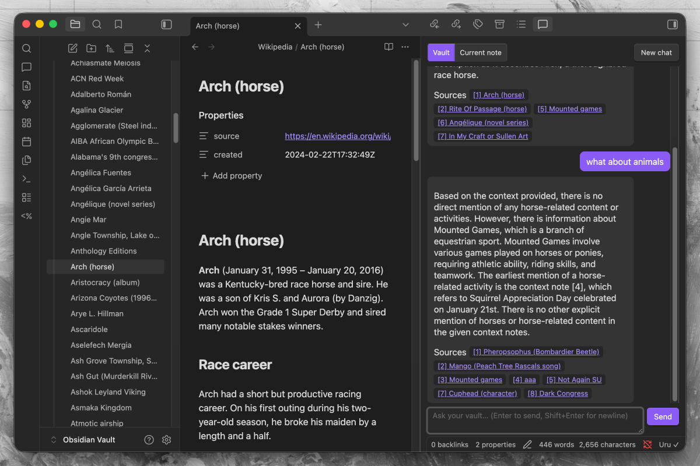

# Uru

**Ask your Obsidian vault anything — and get answers from what you actually wrote, completely offline.**

Uru makes your [Obsidian](https://obsidian.md) vault searchable by meaning and lets you *search* or *chat* with everything you've written — with citations back to the exact notes. Everything runs on your own machine via [llama.cpp](https://github.com/ggml-org/llama.cpp); nothing is uploaded.

It's powered by [Khora](https://github.com/DeytaHQ/khora), a local-first search-and-connections library. Obsidian can't run Python, so Uru ships a tiny local backend that drives Khora for you — you never have to touch it.



## What you can do

- **Search.** Ask a question and get the most relevant passages from across your vault — semantic, not keyword. Each result links back to its note.
- **Chat with your vault.** A RAG chat panel that answers from your notes and cites them by `[1]`, `[2]`. Scope it to the whole vault or just the current note.
- **Index automatically.** New and edited notes are picked up as you write; deletes and renames are handled too. No manual re-sync.
- **Stay private.** No account, no API keys, no network calls after the one-time model download. Your notes never leave your computer — and Uru never alters them.

## Get started

**Requirements:** Obsidian on **desktop** — macOS (**Apple Silicon only, macOS 13.3 or newer**), Windows, or Linux. Uru runs a local backend, so mobile isn't supported; Intel Macs aren't supported because Uru's vector database no longer ships Intel-Mac builds, and macOS 13.3+ is needed because Uru's local AI engine relies on math routines Apple added in that release. No Python, no GPU, no manual model setup — Uru downloads everything it needs on first run.

1. **Install.** In Obsidian: **Settings → Community plugins → Browse**, search for **Uru** (or open its [directory page](https://community.obsidian.md/plugins/uru)), install, and enable.
2. **Run setup.** A dialog opens — click **Install & start**. The first run downloads ~3 GB and sets up a few components. This is one-time; later launches are fast.
3. **Use it.** When the status bar reads **`Uru ✓`**, run the command **"Uru: Index vault"**, then **"Uru: Search in your vault"** or open the chat (💬 ribbon icon).

Installing without the community directory, or with an AI assistant's help? See [Install manually](#install-manually) near the bottom.

## Privacy

This is the whole point of Uru: **everything happens on your own computer.** All the AI runs on local models through llama.cpp, and everything is stored in an on-disk database on your machine. No account, no API keys, and — after the one-time model download — no network calls. Your notes are never copied or uploaded.

### Network use

Uru touches the network in exactly one situation: the first-run setup download (and again only when a plugin update pins newer components). Every download is pinned to an exact version or revision, so the plugin can never silently fetch anything newer than what its release was tested with:

| What | From | Why |
|---|---|---|
| `uv` (version-pinned) | github.com — [astral-sh/uv](https://github.com/astral-sh/uv/releases) release assets | Sets up the Python environment |
| Python 3.13 | github.com — [python-build-standalone](https://github.com/astral-sh/python-build-standalone/releases) release assets, fetched by uv | Runs the sidecar |
| Khora + sidecar dependencies (exact `==` pins) | [PyPI](https://pypi.org) | The retrieval backend |
| llama.cpp `llama-server` (build-pinned) | github.com — [ggml-org/llama.cpp](https://github.com/ggml-org/llama.cpp/releases) release assets | Runs the models |
| Chat + embedding models (revision-pinned GGUFs) | [Hugging Face](https://huggingface.co) | The models themselves |

After that, everything — indexing, search, chat — talks only to Uru's own sidecar on `127.0.0.1`. No telemetry, no analytics, no update pings.

The backend (the Python environment, models, llama.cpp binary, and the index/database) lives **outside your vault**, in per-user app-data, so it survives plugin updates and is never touched by Obsidian Sync:

| OS | Location |
|---|---|
| macOS | `~/Library/Application Support/uru` |
| Windows | `%LOCALAPPDATA%\uru` |
| Linux | `$XDG_DATA_HOME/uru` (or `~/.local/share/uru`) |

A small `vaults.json` at the root of that folder tracks which vaults are using the shared
backend, so cleanup never deletes another vault's data out from under it.

**Uninstalling Uru?** It's a two-step process, because Obsidian's plugin remover only deletes
the plugin's own folder inside your vault — it can't reach outside it:

1. In Obsidian, go to **Settings → Uru → Danger zone → "Uninstall Uru"**. This checks
   whether any other vault is still using the shared backend and only deletes what's safe —
   the models, Python environment, and this vault's index.
2. Then remove the plugin as usual from **Settings → Community plugins**.

If Uru is installed in more than one vault, "Uninstall Uru" stays disabled — deleting the shared
backend would break the other vaults. To stop using Uru in just one vault, disable it there from
**Settings → Community plugins**; the shared backend stays for the rest.

If you already removed the plugin without doing step 1, see
[Troubleshooting](#troubleshooting) for how to clean up manually.

## Hardware

| Your setup | What to expect |
|---|---|
| **Apple Silicon (M1–M4)** | Best experience — the models run on the Metal GPU. Indexing is near-instant; chat is snappy. |
| **Intel Macs** | Not supported. Uru's vector database (LanceDB) stopped shipping Intel-Mac builds, so it can't be installed. (Apple Silicon Macs running Obsidian under Rosetta hit this too — turn Rosetta off in Finder → Obsidian → Get Info.) |
| **Windows / Linux + GPU** | Uru auto-detects a supported GPU (AMD, Nvidia, or Intel) and runs the models on it via a Vulkan build of llama.cpp — much faster. Falls back to CPU automatically if no usable GPU is found. |
| **Windows / Linux, no GPU** | CPU builds of llama.cpp. Indexing is fine; chat answers take a bit longer. |
| **Memory** | A few GB of RAM while running (a 3B chat model plus an embedding model stay resident). Closing the panels lets the backend idle-shut-down after ~2 min. |

## Troubleshooting

- **Stuck on "starting" / setup failed** — the setup dialog (and Settings → Uru) has a **Copy diagnostics** button. Paste that when reporting an issue.
- **`Uru ✕` after it was working** — an inference server may have crashed; Uru restarts it automatically and the badge returns to `Uru ✓`. If it stays red, grab diagnostics.
- **Indexing is slow** — very large vaults can take a while on CPU-only machines. Run **"Uru: Stop indexing"** any time; the next run resumes where it left off.
- **Start over** — to rebuild the index from scratch, use **"Re-index everything"** under Settings → Uru → Indexing. If the local backend itself is misbehaving, **"Repair Uru"** (Settings → Uru → Status) re-runs setup without touching your index.
- **I already removed the plugin and now have leftover files** — Uru couldn't run any cleanup code, since the plugin is gone. Manually delete the per-OS folder from the [Privacy](#privacy) table (e.g. `~/Library/Application Support/uru` on macOS). This is only safe if you're not using Uru in any other vault — if you are, open `uru/vaults.json` to see which `uru/vaults/<id>` subfolder belongs to which vault (by name/path), delete only the ones you no longer need, and leave `uru/runtime` alone.

## Changelog

See [CHANGELOG.md](CHANGELOG.md) for the full release history.

## How it works (for the curious)

```
Obsidian plugin (TypeScript)
  → spawns + Bearer-auth HTTP →  uru_sidecar (Python, FastAPI)
                                   ├─ Khora  (sqlite_lance: SQLite + LanceDB)
                                   └─ proxy → 2× llama.cpp servers (chat + embed)
```

Khora is a pure-Python library, so the plugin drives it through a small local **sidecar**. The sidecar runs two single-model `llama-server` processes — a chat model (used for RAG answers) and an embedding model — behind a one-URL, OpenAI-compatible proxy, then points Khora at them. It supervises those processes and restarts either one if it dies, and idle-shuts-down when you're not using Uru.

**Default models** (~3 GB total):
- Chat: `Qwen2.5-3B-Instruct` (Q4_K_M GGUF) — see [The chat model](#the-chat-model)
- Embeddings: `bge-m3` (Q8_0 GGUF, 1024-dim, 8192-token context — the dimension fixes the vector dimension, so changing it requires a full re-index) — see [The embedding model](#the-embedding-model)

### The chat model

Uru answers your questions with **[`Qwen2.5-3B-Instruct`](https://huggingface.co/Qwen/Qwen2.5-3B-Instruct)**, from [Alibaba's Qwen team](https://huggingface.co/Alibaba-NLP), downloaded as a [quantized GGUF from Hugging Face](https://huggingface.co/bartowski/Qwen2.5-3B-Instruct-GGUF). It's the model behind the **chat** panel: given the passages Uru retrieves from your vault, it writes the answer and the `[1]`, `[2]` citations back to your notes.

Why this one:
- **Small enough to run locally.** At 3B parameters it fits in a few GB of RAM and runs on a laptop CPU (and much faster on Apple Silicon / a supported GPU) — no cloud, no API key.
- **Strong instruction-following for its size.** Qwen2.5-3B holds up well at grounded, "answer only from these passages" RAG prompting, which is exactly what Uru asks of it.
- **`Q4_K_M` quantization** trades a sliver of quality for roughly half the memory and faster generation — the sweet spot for a resident local model.

The model runs entirely on your machine through llama.cpp; nothing you type or retrieve leaves your computer.

### The embedding model

Search and retrieval are powered by **[`bge-m3`](https://huggingface.co/BAAI/bge-m3)**, from [BAAI (Beijing Academy of Artificial Intelligence)](https://huggingface.co/BAAI), also a [quantized GGUF (`Q8_0`) from Hugging Face](https://huggingface.co/lm-kit/bge-m3-gguf). Every note you index is turned into a numeric vector by this model; a search embeds your query the same way and finds the passages whose vectors are closest — that's what makes search *semantic* rather than keyword.

Why this one:
- **Built for retrieval.** `bge-m3` is a dedicated embedding model with strong retrieval quality, so "find what I mean" works even when your wording doesn't match the note's.
- **Multilingual** — it embeds many languages into the same space, so a vault isn't limited to English.
- **Long context (8192 tokens)** lets it embed sizable passages without chopping them into tiny fragments.
- **1024 dimensions** at `Q8_0` keeps vectors compact while preserving quality. This dimension is *fixed*: it defines the shape of every stored vector, so switching embedding models later requires a full re-index.

Like the chat model, it runs locally via llama.cpp — your notes are never uploaded.

<a name="install-manually"></a>
<details>
<summary><b>Install manually</b></summary>

If you'd rather not install through the community directory, Uru installs like any other manual plugin.

> 💡 **Installing with an AI assistant?** Hand it the [For AI assistants](#for-ai-assistants) section below — it's a deterministic, copy-paste procedure with explicit success checks.

**Option A — prebuilt release (no Node needed):** download **`main.js`**, **`manifest.json`**, and **`styles.css`** from the **Assets** section of the [latest release](../../releases/latest) — ⚠️ **not** the "Source code (zip)" link, which omits the built `main.js` and fails to load. Put the three files in `<your-vault>/.obsidian/plugins/uru/` (the Python sidecar is embedded inside `main.js`).

> With the [GitHub CLI](https://cli.github.com), one command grabs the right assets: `gh release download --repo Arsenije/Uru --pattern 'main.js' --pattern 'manifest.json' --pattern 'styles.css' --dir "<your-vault>/.obsidian/plugins/uru"`. The download is small (~150 KB) — that's expected: the backend's dependencies and models download on first run.

**Option B — build from source (needs [Node.js](https://nodejs.org) 18+):** one command builds it and copies everything into place:
```bash
git clone https://github.com/Arsenije/Uru.git
cd Uru
npm install
npm run install-plugin -- "<your-vault>"    # builds, then deploys into .obsidian/plugins/uru/
```

Then, either way: enable Uru in **Settings → Community plugins** and continue from step 2 of [Get started](#get-started).

</details>

<a name="for-ai-assistants"></a>
<details>
<summary><b>For AI assistants</b></summary>

This procedure is safe to run end-to-end. Steps 1–2 are shell commands; steps 3–5 happen inside Obsidian's GUI, so **stop after step 2 and tell the user exactly what to click.**

```
GOAL: Install the Uru Obsidian plugin into the user's vault.

INPUTS YOU NEED FROM THE USER:
  - VAULT  = absolute path to their Obsidian vault (the folder containing `.obsidian/`)

STEP 1 — get the plugin files. Pick ONE:

  Option A — prebuilt release (no Node toolchain needed; prefer this):
    With the GitHub CLI (one command, always the right assets):
      gh release download --repo Arsenije/Uru \
        --pattern 'main.js' --pattern 'manifest.json' --pattern 'styles.css' \
        --dir "<VAULT>/.obsidian/plugins/uru"
      # no tag = newest release. `gh release view --repo Arsenije/Uru` (no tag)
      # shows the latest; the literal word `latest` is NOT a valid tag argument.
    Without gh, download the main.js, manifest.json, and styles.css ASSETS from
    https://github.com/Arsenije/Uru/releases/latest by hand into
    `<VAULT>/.obsidian/plugins/uru/`.
    IMPORTANT: use the individual assets, NOT GitHub's "Source code (zip)" — the
    source archive has no built main.js, so the plugin will fail to load.
    NOTE: the assets are small (~150 KB total) — expected, NOT a broken/partial
    download. The Python sidecar is embedded in main.js; its dependencies and
    the models install on first run.

  Option B — build from source (requires Node.js 18+):
    git clone https://github.com/Arsenije/Uru.git
    cd Uru
    npm install
    npm run install-plugin -- "<VAULT>"   # builds AND copies the plugin files
                                          # into .obsidian/plugins/uru/

STEP 2 — VERIFY staging (headless; this is as far as you can verify — everything
  after this is GUI-only and only the user can confirm it):
  Run the SAME checker for either install path — it prints "OK: Uru <version> staged ...":
    Option B (source clone):     node scripts/verify-staging.mjs "<VAULT>"
    Option A (release assets), or either without a local copy: curl -fsSL \
      https://raw.githubusercontent.com/Arsenije/Uru/main/scripts/verify-staging.mjs \
      | node - "<VAULT>"
  The checker confirms main.js (with the embedded sidecar), manifest.json, and
  styles.css are present and non-empty. Do NOT hand off until it prints "OK:".

STEP 3 — HAND OFF TO THE USER (you cannot click Obsidian's UI):
  Tell them: "Open Obsidian → Settings → Community plugins → enable 'Uru'.
  A setup dialog appears — click 'Install & start'. The first run downloads
  ~3 GB; wait for it."

STEP 4 — tell them the success signal:
  The Obsidian status bar shows `Uru ✓`. If it shows `Uru ✕`, the setup
  dialog (and Settings → Uru) has a "Copy diagnostics" button — ask for that text.

STEP 5 — tell them how to use it:
  Run the command "Uru: Index vault", then "Uru: Search in your vault" or the 💬 chat icon.

DO NOT:
  - Try to install on Obsidian mobile (desktop only).
  - Place files outside `<VAULT>/.obsidian/plugins/uru/`.
  - Install Python, llama.cpp, or models by hand — Uru bootstraps them itself.
```

**Facts for assistants** (stable, machine-readable):

| Key | Value |
|---|---|
| Plugin id | `uru` |
| Plugin files to deploy | `main.js` (carries the embedded Python sidecar), `manifest.json`, `styles.css` |
| Deploy target | `<VAULT>/.obsidian/plugins/uru/` |
| Install from source (build + deploy) | `npm install && npm run install-plugin -- "<VAULT>"` |
| Headless staging check (source clone) | `node scripts/verify-staging.mjs "<VAULT>"` |
| Release-asset download (GitHub CLI) | `gh release download --repo Arsenije/Uru --pattern 'main.js' --pattern 'manifest.json' --pattern 'styles.css' --dir "<VAULT>/.obsidian/plugins/uru"` |
| Release-assets size | ~150 KB total (sidecar embedded in main.js; deps download on first run) |
| Platforms | macOS, Windows, Linux (desktop only; **no mobile**) |
| Runtime prerequisites | None — Python 3.13, llama.cpp, and models auto-download on first run |
| First-run download | ~3 GB (chat model + embedding model + llama.cpp runtime) |
| Ready signal | Status bar reads `Uru ✓` |
| Error signal | Status bar reads `Uru ✕`; use the "Copy diagnostics" button |
| Backend/data location | Outside the vault, in per-user app-data (see [Privacy](#privacy)) |

</details>

<details>
<summary><b>Build & develop from source</b></summary>

```bash
npm install
npm run dev          # watch-build main.js
npm run build        # production build + typecheck
```

The backend bootstraps on first run (`uv` installs Python 3.13 + Khora + llama.cpp and downloads the models). In this repo a dev venv (`sidecar/.venv`) and cached models (`sidecar/.models`) are reused automatically **if they match the pinned Khora version**; otherwise Uru falls through to a clean app-data bootstrap.

Sidecar smoke test (remember → recall → forget):

```bash
cd sidecar
PYTHONPATH=. .venv/bin/python scripts/smoke_sidecar.py
```

Repo layout:

```
Uru/
├── main.ts              # plugin entry — lifecycle, commands, status
├── src/
│   ├── bootstrap/uv.ts  # uv-based Python/Khora bootstrap + model download
│   ├── sidecar/         # process manager + typed HTTP client
│   ├── indexing/        # full + incremental vault indexing (hash-gated)
│   ├── views/           # search + chat panels
│   └── settings.ts      # settings tab
└── sidecar/             # Python sidecar (FastAPI + llama.cpp supervisor)
    └── uru_sidecar/
```

</details>

## License

[MIT](LICENSE)
